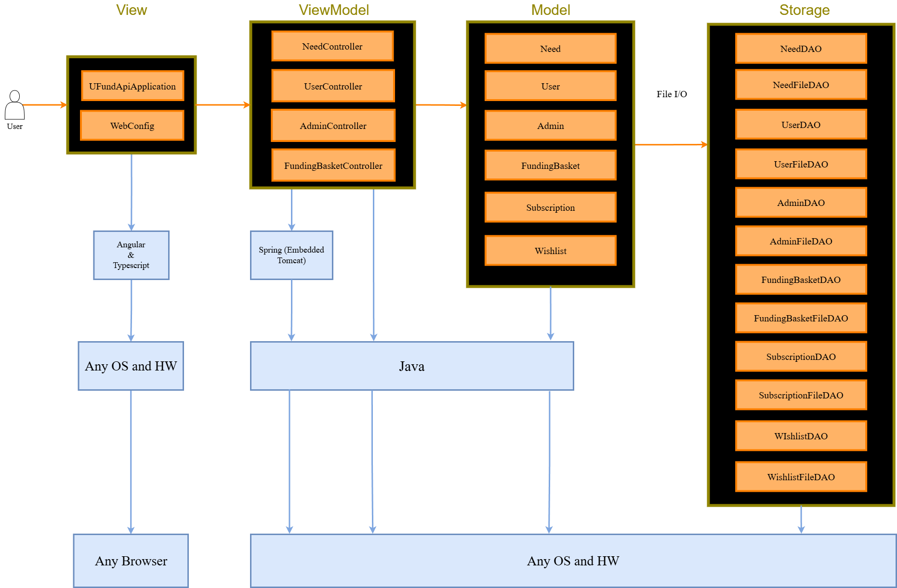
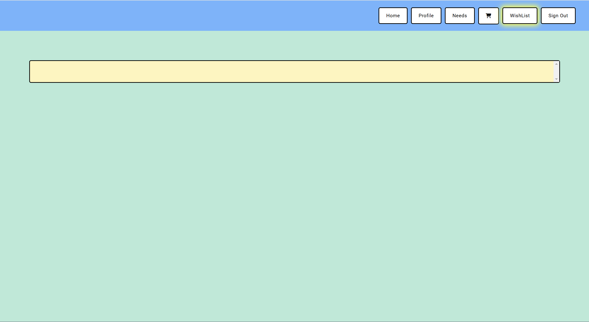
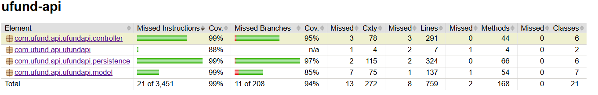

# PROJECT Design Documentation

> _The following template provides the headings for your Design
> Documentation.  As you edit each section make sure you remove these
> commentary 'blockquotes'; the lines that start with a > character
> and appear in the generated PDF in italics but do so only **after** all team members agree that the requirements for that section and current Sprint have been met. **Do not** delete future Sprint expectations._

## Team Information
* Team name: Black Market Donations
* Team members
  * Conner Jack DeFeo
  * Andy D'Angelo
  * Ben Kedson
  * Oumar Toure
  * Francis Grant

## Executive Summary

This is the Black Market Donations U-Fund project. Our project name is "Bee The Change" A UI and API are created to generate a website for helpers to donate to help save the bees!
Every user will have access to a funding basket which they can add needs to, remove needs from, and checkout to help save the previously mentioned bees.
Admins will be able to edits need cupboards, which hold the needs.

### Purpose
> Sprint 2: FOr this sprint 

### Glossary and Acronyms
> _**[Sprint 2 & 4]** Provide a table of terms and acronyms._

| Term | Definition |
|------|------------|
| SPA | Single Page |

## Requirements

This section describes the features of the application.

Search bar: Users should be able to search in their funding baskets and the needs cupboard

Funding baskets: Each user will have one to hold and eventually checkout with needs

Need cupboard: Will contain needs that all users can add to their funding baskets

Users: Users should be able to log into and out of their accounts, veiwing their funding baskets and the need cupboard. They should also be able to edit their profile.

Admin: Admin can login wiht the username 'admin' and then edit the needs cupboard

### Definition of MVP

Users can log in and out of application, add and remove needs, and checkout their funding baskets.
Admins may edit the need cupboard

### MVP Features

As a Developer I WANT to submit a request to create a new need SO THAT it is added to the cupboard.
As a Developer I WANT to submit a request to get a single need SO THAT I can access the cost, quantity and type.
As a Developer I WANT to submit a request to get the entire cupboard SO THAT I have access to all of the needs for the organization.
As a Developer I want to submit a request to delete a single need SO THAT it is no longer in the cupboard
As a Developer I WANT to submit a request to get the the needs in the cupboard whose name contains the given text, SO THAT I have access to only that subset of needs.
As A Developer I WANT to submit a request to get the cupboard SO THAT I can update needs in the cupboard.
As a User I want to have a clean, well-written web front-end so that I can intuitively and easily interact with the platform.
As a User I want to have a clean, well-written web front-end so that I can intuitively and easily interact with the platform.
As a Admin, I want to edit my needs cupboard so i can change the given needs avalible
As a User, I want to edit my funding basket so i can support different u-fund projects
As a Helper I want to pay for all the needs in my basket at once so that the process of contributing to needs is simplified.
As a Helper I want to subscribe to a need so that I may contribute to it at regular intervals without needing to constantly retrieve it from the cupboard.
As a helper I WANT to add a need to my wishlist WHEN i dont want to purchase it yet SO i can buy it later in a easier manner

### Enhancements

BMD has decided to implement a subscription list and a wishlist as our feature enhancements. The wishlist will allow users to save and later export to the basket needs that they would like to support in the future, but do not have the funds to support at the moment. Users may add items to their wishlist by clicking the wishlist button in the cupboard and then confirming the need in the subsequent pop-up. The needs can then be removed from the wishlist by clicking the x in the wishlist page or by clicking the add to basket button. The subscription list will allow for users to support a given monetary or supply need at the start of every month. Users can add items to their subscriber list by first checking that they would like to subscribe to a need in the cupboard and then finalizing that subscription by checking out their basket. These items will be charged each month and can by removed at any time through the user profile page.

## Application Domain

This section describes the application domain.

Users can add and remove needs to their funding basket.
Admins can edit or remove the needs within the cupboard and add new needs to that cupboard.
Needs are contained in the funding basket, needs cupboard, subscription list, and wishlist.

## Architecture and Design

This section describes the application architecture.

### Summary

The following Tiers/Layers model shows a high-level view of the webapp's architecture. 
**NOTE**: detailed diagrams are required in later sections of this document.
> _**[Sprint 1]** (Augment this diagram with your **own** rendition and representations of sample system classes, placing them into the appropriate M/V/VM (orange rectangle) tier section. Focus on what is currently required to support **Sprint 1 - Demo requirements**. Make sure to describe your design choices in the corresponding _**Tier Section**_ and also in the _**OO Design Principles**_ section below.)_

The web application, is built using the Model–View–ViewModel (MVVM) architecture pattern. 

The Model stores the application data objects including any functionality to provide persistance. 

The View is the client-side SPA built with Angular utilizing HTML, CSS and TypeScript. The ViewModel provides RESTful APIs to the client (View) as well as any logic required to manipulate the data objects from the Model.

Both the ViewModel and Model are built using Java and Spring Framework. Details of the components within these tiers are supplied below.

### Overview of User Interface

This section describes the web interface flow; this is how the user views and interacts with the web application.

<!-- > _Provide a summary of the application's user interface.  Describe, from the user's perspective, the flow of the pages in the web application._ -->

When any user goes to the website they are greeted by this Home Page(1). From here, they can either navigate to a Signed Out Needs Page(2) or the Sign In Page(3) with the Navigation Bar. 1. Signed Out Home Page

From the Signed Out Needs Page, a signed out user can view the needs in the cupboard. From this page they can navigate to the Signed Out Home Page(1) or the Sign In Page(3)  with the Navigation Bar. 2. Signed Out Needs Page

From the Sign In Page, a user can navigate to the Signed Out Home Page(1) or the Signed Out Needs Page(2) with the Navigation Bar. If this user is an admin they can enter admin as their username and will be navigated to the Admin Home Page(5). If a user does not have an account with Bee the Change they can click the sign up button and they will be navigated to the Sign Up Page(4). If a user already has an account they can enter and confirm their username and will then be navigated to the User Home Page(7) assuming that the username is in the system. 
From the Sign Up Page, a user can navigate to the Signed Out Home Page(1), the Signed Out Needs Page(2), or the Sign In Page(3) with the Navigation Bar. If they wish to create an account they can enter in and confirm a username and will be navigated to the User Home Page(7) assuming that the usernames entered match. 4. Sign Up Page

From the Admin Home Page, an Admin can either sign out or navigate to the Admin Needs Page(6) with the Navigation Bar. 
From the Admin Needs Page, an Admin can either sign out or navigate to the Admin Home Page(5) with the Navigation Bar. Within the Admin Needs Page the Admin can add, remove, and edit needs. 6. Admin Needs Page

From the User Home Page, a user can sign out or navigate to the User Needs Page(8), the User Wishlist Page(9), the User Basket Page(10), or the User Profile Page(11) with the Navigation Bar. 7. User Home Page

From the User Needs Page, a user can sign out or navigate to the User Home Page(7), the User Wishlist Page(9), the User Basket Page(10), or the User Profile Page(11) with the Navigation Bar. Within the User Needs Page, the user can view the needs and add needs from the cupboard to their basket or wishlist. 8. User Needs Page

From the User Wishlist Page, a user can sign out or navigate to the User Home Page(7), the User Needs Page(8), the User Basket Page(10), or the User Profile Page(11) with the Navigation Bar. Within the User Wishlist Page, the user can view their wishlist, remove needs from their wishlist, or transfer needs in their wishlist to their cupboard. 9. User Wishlist Page

From the User Needs Page, a user can sign out or navigate to the User Home Page(7), the User Needs Page(8), the User Wishlist Page(9), or the User Profile Page(11) with the Navigation Bar. Within the User Basket Page, the user can view, remove, or checkout the needs in their basket. This removes the needs and add any marked as subscriptions to their subscription list. 10. User Basket Page

From the User Profile Page, a user can sign out or navigate to the User Home Page(7), the User Needs Page(8), the User Wishlist Page(9), or the User Basket Page(10) with the Navigation Bar. Within the User Profile Page, the user can view their subscriber list and its next renewal date. They can also remove needs from their subscriber list.11. User Profile Page

### View Tier
Our view tier contains six main classes, each with their own DAO, fileDAO, and controller classes. These are as follows: 
User, Admin, Funding Basket, Wishlist, Subscription, Needs Cupboard.
Each classes fileDAO save to their respective files, and their controlelrs handle everything to do with that class. An 
exceptions arise however with the user class, as SubscriptionDAO, FundingBasketDAO, and WishListDAO are all also called 
in the creation or deletion of a user in order to properly create those respective items for the user.

### ViewModel Tier

Sense it will be repetative to say so for every class, i will simply explain how all function on a macro level here:
All classes in this tier have a DAO, fileDAO, and controller class. For DAO and filDAO classes, they are simply used for basic underyling logic such as creation or deletion. They are also used to save data to their respective files. DAO classes are merley and interface to be used by controller classes so that controller classes do not have access to certain private functionality of the FileDAO classes. All controller clases use their respective FileDAO classes, which use their respective DAO classes. The only excpetion here would be with the user controller.Sense all fileDAO and DAO classes do the same, only the controller classes warrant an in deapth discussion. All of the foregoing syntax in regards to "creation", "deletion", and "editation" will be made in reference to requests made for such instances, as these are classes specifically designed soley for that purpose.

NeedController: Simply handles HTTP requests to delete, edit, and add needs to the need cupboard. 

WishlistController: Handles HTTP reqests for adding and removing needs from wishlist. Wishlists may not be destroyed or created in this class

UserController: As mentioned, user controlelr is somewhatunique. Handles the creation, deletion, and editation of user. However, when ever a user is created or destroyed, this class calls upon FundingBasketFileDAO, WishlistFileDAO, and SubscriptionFileDAO to create or remove the neccessary instances for that user. This is the onyl controller class with such overlap

FundingBasket: Only allows the addition and deletion of needs.

Admin: Handles creation, deletion, and editation of an admin. No need cupboard is created with it, sense there is only one.

Subscriptions: Only addition and deletion of needs are handles here. 

### Model Tier

Need: Needs contain an ID, name, cost, quantity, and type. All of the afroementioned may be edited, and needs may be deleted or create by an admin.

NeedDatePair: Simply contains a need and a date, used exclusivley for subscription tracking services

Wishlist: Contains user id tracking a specified user, and a list of needs. Needs may be added or removed from this list, and the wishlist may be created or destroyed in the event either of the preceing mention events also occurs to a user. 

User: Has and id, username, and siging variables. Sigin is a boolean checking if the user is currently siging into a session and can signin again. Users may be edited, created, and destroyed.

FundingBasket: Contains a user ID, list of needs, and total cost of the basket. Keeps track of users current needs they are looking to purchase. Needs may be added or removed from this list, and the funding basket may be created or destroyed in the event either of the preceing mention events also occurs to a user. 

Admin: Contains an id an username. Has access to the needscupboard and is able to edit it. has function isAdmin() to check if the user using the application is one and is therefore granted special privilages.

Subscriptions: Contains id, list of needs, and a list of need date pairs. One list will contain needs that have not yet been added to the subscription list but are in the funding basket to be added, and one will keep track of the current subscriptions of the user using need date pairs to see how long until renewal will occur.

## OO Design Principles

Open/Closed
  BMD is incorporating the Open/Closed principle in our design by planning for all classes to be extendable, but not extensively changed in their functionality. For example, the needFileDAO class implements the NeedDAO class, and the NeedDAO class is used via other functions so that NeedFileDAO has some private and untouchable characteristics. We could still improve in this area by making some sort of extendable basket, so that wishlist and afunding basket could both polymorph from it in order to keep more efficient code.
  

Single Responsibility
  BMD is incorporating the Single Responsibility principle in our design by having each class be focused in its use. For example, the NeedController class’s purpose is to handle API requests and respond with HTTP Codes. It does not manage Need data and its storage. Instead, this job is outsourced to the NeedFileDAO class. Our usage of the single responsible principle could be further improved by consistent checking whenever a class is created that it only has one responsibility and by using the same framework with Basket and Cupboard as with Need.
  
  

Dependency Inversion/Injections
	This principle will be designed in our design in a variety of ways. We will design our system to follow the Dependency Inversion principle by ensuring that high-level modules do not depend on low-level modules. Instead, both will depend on abstractions. Here is a list of all examples of this from our current project:
  For example, funding Baskets will be created separately from the user. I.E, the user will not be the one to instantiate or create a new funding baskets when they want to, that will be the job of the application to create one then inject the funding basket into the user’s current list of funding baskets
  To further improve adherence to Dependency Inversion, we could ensure that all dependencies are handled through interfaces or abstract classes rather than concrete implementations. This would allow us to easily swap out implementations in the future without impacting the high-level code
  

Law of Demeter
  This principle will be implemented by BMD in a variety of ways. The obvious cases we have endevoured upon so far have been in regards to our UserController using FundingBasketFileDAO, which is used by FundingBasketController, which in turn accesses NeedFileDAO. UserController does not access NeedFileDao directly to move needs from the cupboard to their dfunding basket. Our code isnt perfect, and we still have areas we could improve, and we could further enhance out LoD by making our controllers specifically more independant and only talk to their "neighbors".
  

## Static Code Analysis/Future Design Improvements

Backend static analysis:

In our analysis of the backend, we did not find any duplications and 92% of our code was covered in testing. We got and A for all of the areas so the only things we would most liley need to improve upon is more code coverage.

Frontend static analysis:

As for our frontend, the analysis wasn't so pretty. There was no code coverage because we havn't learned it. We lost some points in reliability due to form labels not properly being asigned to certain controls and not adding proper alt atributes to our images.

We also had some issues in regard to duplications, specifically with our need popup being duplicated unnesesarally.

Overall we should strive to fix the duplications in need popup and fix how we asign alt atributes to images along with assining proper labels to form controls.

## Testing

### Acceptance Testing

All 9 tests for all 9 current main backend classes have passed their acceptance criteria and edge cases

### Unit Testing and Code Coverage

Our unit testing strategy was to test all our models to make sure they run as they should after first creating them. This made sure we were able to catch any errors that would have caused any further coding to be invalid in things like our persistence classes. We made sure that the classes could run by themselves. We would then create the persistence classes for the models we just created, and again test if they could run by themselves. We would then repeat the process for our controller classes. We made sure to have at least the functionality fully tested before moving on to the next classes that may need the one we were testing. We targetted the functions that were being used in the higher levels in our code and prioritized their functionality over some of the more flavor functions. We made sure to check for the expected errors and made sure that the right responses were made. Our code coverege overall was around 90% as seen below.

However, we could have improved some of our coverage by adding more examples that tested more edge cases. This can be seen in the code coverage of our model classes as shown below. 

Our controller and persistence classes, however, are close to complete coverage as shown below. 

## Ongoing Rationale

**[Sprint 2]**
Backend will be handled by: Jack and Oumar
Front end will be by: Francis, Andy, and Ben
(2024/10/1): Frontend will be themed around spring colors.
(2024/10/19): Only one admin user will exist and will he hardcoded into the users.json.
(2024/10/19): Needs will be displayed through an active search feature rather than a static get.

**[Sprint 3]**
Front and backend of wishlist enhancment handled by: Jack
Front end of subscription handled by: Francis, Andy
Checkout handled by: Ben, Andy
Backend of subscription handled by: Oumar
(2024/11/30): Subscriptions will show up in the user profile after being checked out.
(2024/11/30): Wishlist button next to basket button.
(2024/11/30): Only subscribe to certain need types

**[Sprint 4]**
(2024/12/2): All team members will work on the design doc to get it up to date.
(2024/12/2): All team members will work on the final presentation.
(2024/12/3): All team members will present the final in class.